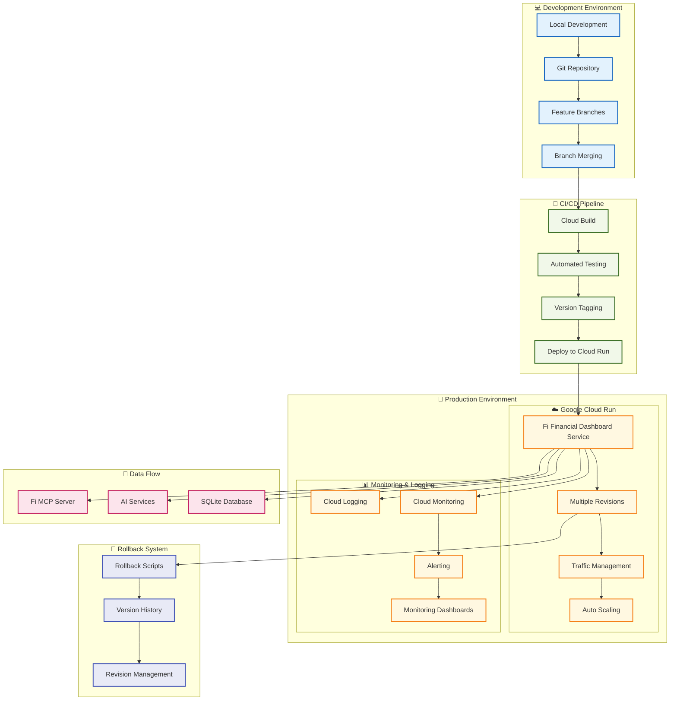
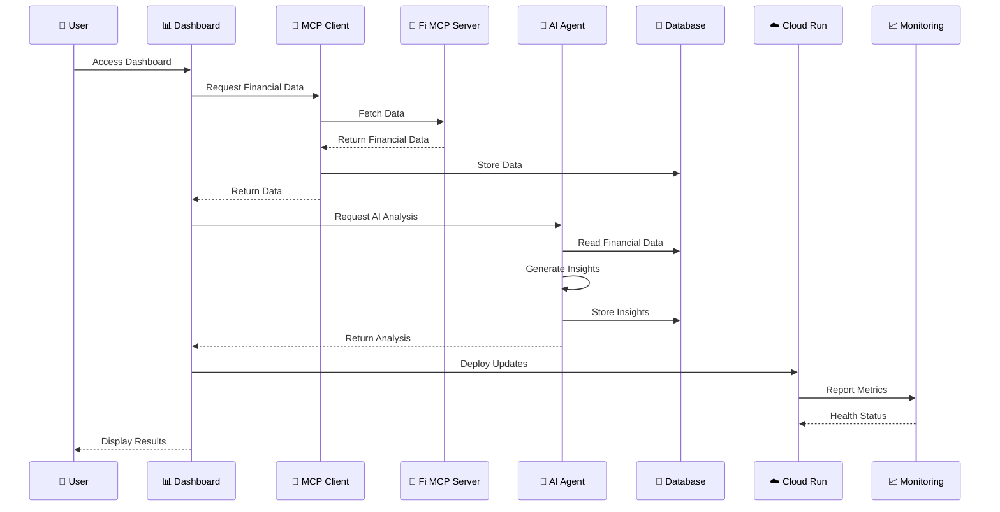
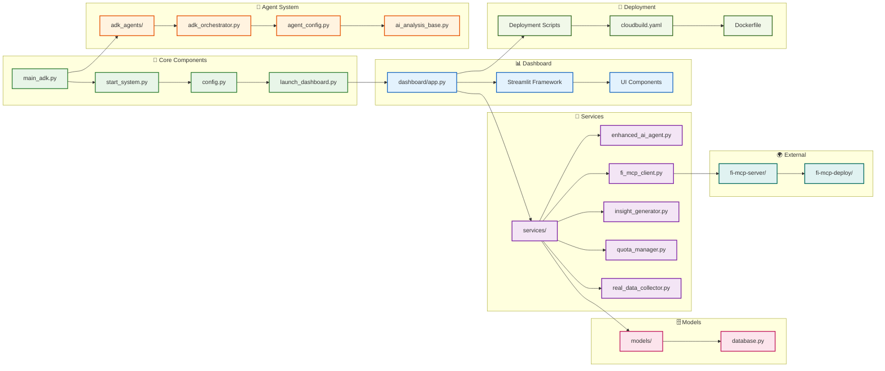
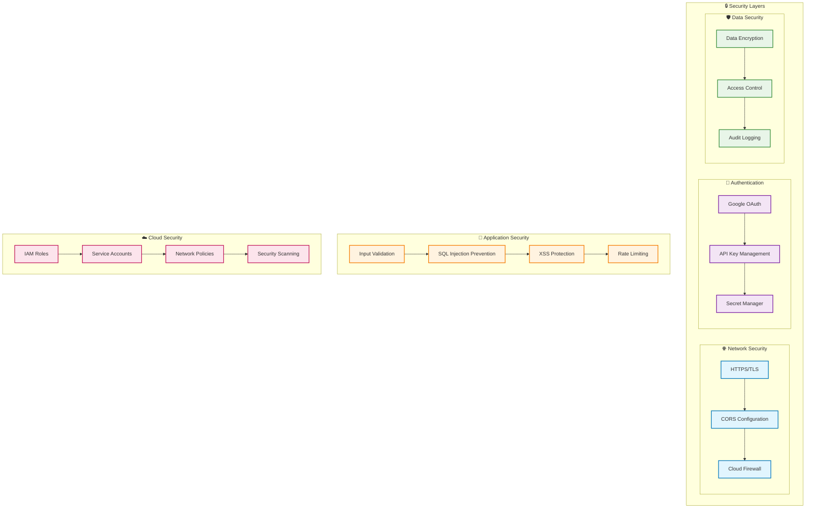
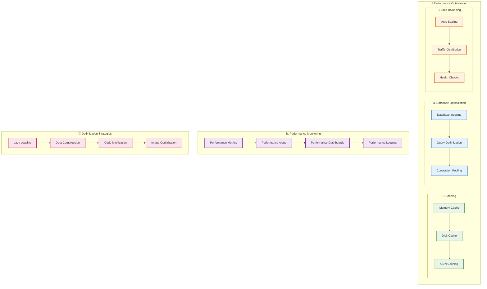

# 🏗️ Fi Financial AI Dashboard - Architecture Diagram

## System Overview

```mermaid
graph TB
    %% User Interface Layer
    subgraph "🌐 User Interface Layer"
        UI[Streamlit Dashboard]
        WEB[Web Browser]
        MOBILE[Mobile Browser]
    end

    %% Application Layer
    subgraph "🚀 Application Layer"
        subgraph "📊 Dashboard Components"
            DASH[Streamlit App]
            INSIGHTS[AI Insights Generator]
            PORTFOLIO[Portfolio Analysis]
            STOCKS[Stock Tracker]
            SUBSCRIPTIONS[Subscription Tracker]
            CREDIT[Credit Analysis]
            MCP_AGENT[MCP AI Agent]
            SYSTEM_STATUS[System Status]
        end
        
        subgraph "🤖 AI Agents"
            ADK_ORCH[ADK Orchestrator]
            MARKET_AGENT[Market Analysis Agent]
            RISK_AGENT[Risk Assessment Agent]
            FINANCIAL_AGENT[Financial Data Collector]
            SUBSCRIPTION_AGENT[Subscription Tracking Agent]
            MCP_PERIODIC[MCP Periodic AI Agent]
        end
    end

    %% Services Layer
    subgraph "🔧 Services Layer"
        subgraph "📡 Data Services"
            MCP_CLIENT[Fi MCP Client]
            REAL_DATA[Real Data Collector]
            QUOTA_MGR[Quota Manager]
            LOGGER[Logger Config]
        end
        
        subgraph "🧠 AI Services"
            ENHANCED_AI[Enhanced AI Agent]
            INSIGHT_GEN[Insight Generator]
        end
    end

    %% Data Layer
    subgraph "💾 Data Layer"
        subgraph "🗄️ Database"
            SQLITE[SQLite Database]
            MCP_DATA[(MCP Data)]
            AI_INSIGHTS[(AI Insights)]
            USER_DATA[(User Data)]
        end
        
        subgraph "📁 File Storage"
            LOGS[Log Files]
            CONFIG[Configuration Files]
            STATIC[Static Assets]
        end
    end

    %% External Services
    subgraph "🌍 External Services"
        subgraph "🏦 Financial APIs"
            FI_MCP[Fi MCP Server]
            STOCK_API[Stock Market APIs]
            CREDIT_API[Credit Report APIs]
        end
        
        subgraph "🤖 AI Services"
            GEMINI[Google Gemini AI]
            VERTEX_AI[Google Vertex AI]
            GOOGLE_AI[Google AI Platform]
        end
        
        subgraph "☁️ Google Cloud"
            CLOUD_RUN[Google Cloud Run]
            CLOUD_BUILD[Cloud Build]
            CONTAINER_REG[Container Registry]
            CLOUD_LOGGING[Cloud Logging]
            CLOUD_MONITORING[Cloud Monitoring]
            SECRET_MANAGER[Secret Manager]
            BIGQUERY[BigQuery]
            FIRESTORE[Firestore]
            PUBSUB[Pub/Sub]
            CLOUD_FUNCTIONS[Cloud Functions]
            CLOUD_SCHEDULER[Cloud Scheduler]
        end
    end

    %% Connections - User Interface
    WEB --> UI
    MOBILE --> UI
    UI --> DASH

    %% Connections - Dashboard Components
    DASH --> INSIGHTS
    DASH --> PORTFOLIO
    DASH --> STOCKS
    DASH --> SUBSCRIPTIONS
    DASH --> CREDIT
    DASH --> MCP_AGENT
    DASH --> SYSTEM_STATUS

    %% Connections - AI Agents
    DASH --> ADK_ORCH
    ADK_ORCH --> MARKET_AGENT
    ADK_ORCH --> RISK_AGENT
    ADK_ORCH --> FINANCIAL_AGENT
    ADK_ORCH --> SUBSCRIPTION_AGENT
    ADK_ORCH --> MCP_PERIODIC

    %% Connections - Services
    DASH --> MCP_CLIENT
    DASH --> REAL_DATA
    DASH --> QUOTA_MGR
    DASH --> LOGGER
    DASH --> ENHANCED_AI
    DASH --> INSIGHT_GEN

    %% Connections - Data Layer
    MCP_CLIENT --> SQLITE
    REAL_DATA --> SQLITE
    ENHANCED_AI --> SQLITE
    INSIGHT_GEN --> SQLITE
    LOGGER --> LOGS
    DASH --> CONFIG

    %% Connections - External Services
    MCP_CLIENT --> FI_MCP
    REAL_DATA --> STOCK_API
    REAL_DATA --> CREDIT_API
    ENHANCED_AI --> GEMINI
    ENHANCED_AI --> VERTEX_AI
    ENHANCED_AI --> GOOGLE_AI

    %% Connections - Google Cloud
    DASH --> CLOUD_RUN
    CLOUD_RUN --> CLOUD_BUILD
    CLOUD_BUILD --> CONTAINER_REG
    CLOUD_RUN --> CLOUD_LOGGING
    CLOUD_RUN --> CLOUD_MONITORING
    CLOUD_RUN --> SECRET_MANAGER
    CLOUD_RUN --> BIGQUERY
    CLOUD_RUN --> FIRESTORE
    CLOUD_RUN --> PUBSUB
    CLOUD_RUN --> CLOUD_FUNCTIONS
    CLOUD_RUN --> CLOUD_SCHEDULER

    %% Styling
    classDef userInterface fill:#e1f5fe,stroke:#01579b,stroke-width:2px
    classDef application fill:#f3e5f5,stroke:#4a148c,stroke-width:2px
    classDef services fill:#e8f5e8,stroke:#1b5e20,stroke-width:2px
    classDef data fill:#fff3e0,stroke:#e65100,stroke-width:2px
    classDef external fill:#fce4ec,stroke:#880e4f,stroke-width:2px
    classDef cloud fill:#e0f2f1,stroke:#004d40,stroke-width:2px

    class UI,WEB,MOBILE userInterface
    class DASH,INSIGHTS,PORTFOLIO,STOCKS,SUBSCRIPTIONS,CREDIT,MCP_AGENT,SYSTEM_STATUS,ADK_ORCH,MARKET_AGENT,RISK_AGENT,FINANCIAL_AGENT,SUBSCRIPTION_AGENT,MCP_PERIODIC application
    class MCP_CLIENT,REAL_DATA,QUOTA_MGR,LOGGER,ENHANCED_AI,INSIGHT_GEN services
    class SQLITE,MCP_DATA,AI_INSIGHTS,USER_DATA,LOGS,CONFIG,STATIC data
    class FI_MCP,STOCK_API,CREDIT_API,GEMINI,VERTEX_AI,GOOGLE_AI external
    class CLOUD_RUN,CLOUD_BUILD,CONTAINER_REG,CLOUD_LOGGING,CLOUD_MONITORING,SECRET_MANAGER,BIGQUERY,FIRESTORE,PUBSUB,CLOUD_FUNCTIONS,CLOUD_SCHEDULER cloud
```

## Deployment Architecture

## Data Flow Architecture

## Component Architecture

## Security Architecture

## Performance Architecture

## Technology Stack

```mermaid
graph TB
    %% Frontend
    subgraph "🎨 Frontend"
        STREAMLIT[Streamlit]
        PLOTLY[Plotly]
        PANDAS[Pandas]
        NUMPY[NumPy]
    end

    %% Backend
    subgraph "⚙️ Backend"
        PYTHON[Python 3.11]
        FASTAPI[FastAPI]
        UVICORN[Uvicorn]
        SQLALCHEMY[SQLAlchemy]
    end

    %% AI/ML
    subgraph "🤖 AI/ML"
        LANGCHAIN[LangChain]
        GEMINI[Google Gemini]
        VERTEX_AI[Vertex AI]
        GOOGLE_GENAI[Google Generative AI]
    end

    %% Cloud Services
    subgraph "☁️ Google Cloud"
        CLOUD_RUN[Cloud Run]
        CLOUD_BUILD[Cloud Build]
        CONTAINER_REG[Container Registry]
        CLOUD_LOGGING[Cloud Logging]
        CLOUD_MONITORING[Cloud Monitoring]
        SECRET_MANAGER[Secret Manager]
        BIGQUERY[BigQuery]
        FIRESTORE[Firestore]
        PUBSUB[Pub/Sub]
        CLOUD_FUNCTIONS[Cloud Functions]
        CLOUD_SCHEDULER[Cloud Scheduler]
    end

    %% External APIs
    subgraph "🌍 External APIs"
        FI_MCP[Fi MCP Server]
        STOCK_APIS[Stock Market APIs]
        CREDIT_APIS[Credit Report APIs]
        ALPHA_VANTAGE[Alpha Vantage]
        FINNHUB[Finnhub]
    end

    %% Database
    subgraph "🗄️ Database"
        SQLITE[SQLite]
        GOOGLE_SHEETS[Google Sheets]
        CSV[CSV Files]
    end

    %% DevOps
    subgraph "🛠️ DevOps"
        DOCKER[Docker]
        GIT[Git]
        BASH[Bash Scripts]
        YAML[YAML Configs]
    end

    %% Connections
    STREAMLIT --> PLOTLY
    PLOTLY --> PANDAS
    PANDAS --> NUMPY
    
    PYTHON --> FASTAPI
    FASTAPI --> UVICORN
    UVICORN --> SQLALCHEMY
    
    LANGCHAIN --> GEMINI
    GEMINI --> VERTEX_AI
    VERTEX_AI --> GOOGLE_GENAI
    
    CLOUD_RUN --> CLOUD_BUILD
    CLOUD_BUILD --> CONTAINER_REG
    CLOUD_RUN --> CLOUD_LOGGING
    CLOUD_RUN --> CLOUD_MONITORING
    CLOUD_RUN --> SECRET_MANAGER
    CLOUD_RUN --> BIGQUERY
    CLOUD_RUN --> FIRESTORE
    CLOUD_RUN --> PUBSUB
    CLOUD_RUN --> CLOUD_FUNCTIONS
    CLOUD_RUN --> CLOUD_SCHEDULER
    
    FI_MCP --> STOCK_APIS
    STOCK_APIS --> CREDIT_APIS
    CREDIT_APIS --> ALPHA_VANTAGE
    ALPHA_VANTAGE --> FINNHUB
    
    SQLITE --> GOOGLE_SHEETS
    GOOGLE_SHEETS --> CSV
    
    DOCKER --> GIT
    GIT --> BASH
    BASH --> YAML

    %% Styling
    classDef frontend fill:#e1f5fe,stroke:#0277bd,stroke-width:2px
    classDef backend fill:#f3e5f5,stroke:#7b1fa2,stroke-width:2px
    classDef ai fill:#e8f5e8,stroke:#2e7d32,stroke-width:2px
    classDef cloud fill:#fff3e0,stroke:#e65100,stroke-width:2px
    classDef external fill:#fce4ec,stroke:#c2185b,stroke-width:2px
    classDef database fill:#e0f2f1,stroke:#00695c,stroke-width:2px
    classDef devops fill:#f1f8e9,stroke:#33691e,stroke-width:2px

    class STREAMLIT,PLOTLY,PANDAS,NUMPY frontend
    class PYTHON,FASTAPI,UVICORN,SQLALCHEMY backend
    class LANGCHAIN,GEMINI,VERTEX_AI,GOOGLE_GENAI ai
    class CLOUD_RUN,CLOUD_BUILD,CONTAINER_REG,CLOUD_LOGGING,CLOUD_MONITORING,SECRET_MANAGER,BIGQUERY,FIRESTORE,PUBSUB,CLOUD_FUNCTIONS,CLOUD_SCHEDULER cloud
    class FI_MCP,STOCK_APIS,CREDIT_APIS,ALPHA_VANTAGE,FINNHUB external
    class SQLITE,GOOGLE_SHEETS,CSV database
    class DOCKER,GIT,BASH,YAML devops
```

## Key Features

- **🎯 Multi-Agent System**: Orchestrated AI agents for different financial analysis tasks
- **📊 Real-time Dashboard**: Streamlit-based interactive financial dashboard
- **🤖 AI-Powered Insights**: Google Gemini and Vertex AI integration
- **🔄 Versioned Deployment**: Full rollback capability with Cloud Run revisions
- **📡 MCP Integration**: Fi MCP server for real financial data
- **☁️ Cloud-Native**: Built on Google Cloud Platform with auto-scaling
- **🔒 Secure**: OAuth authentication, API key management, and data encryption
- **📈 Monitored**: Comprehensive logging and monitoring
- **🚀 CI/CD**: Automated deployment pipeline with testing
- **💾 Data Persistence**: SQLite database with backup capabilities 