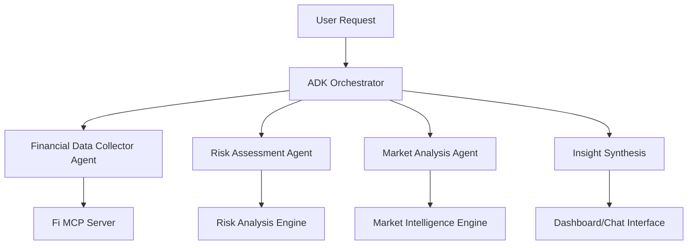

# 🤖 Financial Multi-Agent System with Google Cloud ADK

A sophisticated financial intelligence system powered by **Google Cloud Agent Development Kit (ADK)** featuring multiple specialized AI agents working together to provide comprehensive financial analysis.

## 🎯 Overview

This project transforms a traditional financial analysis system into a **multi-agent architecture** using Google Cloud ADK, where specialized agents collaborate to deliver superior financial insights.

### 🏗️ Multi-Agent Architecture



### 🤖 Specialized Agents

1. **🔍 Financial Data Collector Agent**
   - Real-time data collection from Fi MCP server
   - Data quality assessment and validation
   - Multi-source financial data integration

2. **⚖️ Risk Assessment Agent**
   - Portfolio risk analysis and stress testing
   - Advanced risk metrics calculation
   - Scenario analysis and mitigation strategies

3. **📈 Market Analysis Agent**
   - Technical and fundamental market analysis
   - Market regime identification
   - Investment opportunity discovery

4. **🎯 ADK Orchestrator Agent**
   - Multi-agent workflow coordination
   - Cross-agent insight synthesis
   - System health monitoring

## 🚀 Quick Start Guide

### Prerequisites

1. **Google Cloud Project** with billing enabled
2. **Python 3.9+** installed
3. **Fi MCP Server** running on port 8080
4. **Google API Key** or Vertex AI access

### Installation

1. **Clone and setup:**
```bash
git clone <repository-url>
cd Google-AgenticAI-Hackathon
git checkout feature/adk-multiagent-system
```

2. **Install dependencies:**
```bash
pip install -r requirements.txt
```

3. **Configure environment:**
```bash
# Copy and edit environment file
cp .env.example .env

# Required settings:
GOOGLE_GENAI_USE_VERTEXAI=1
GOOGLE_CLOUD_PROJECT=your-project-id
GOOGLE_CLOUD_LOCATION=us-central1
GOOGLE_API_KEY=your-google-api-key
```

4. **Start Fi MCP Server:**
```bash
cd fi-mcp-server
FI_MCP_PORT=8080 go run .
```

### Running the Multi-Agent System

#### Option 1: ADK Command Line (Recommended)
```bash
# Using ADK framework (requires ADK installation)
adk run financial_assistant
```

#### Option 2: Direct Python Execution
```bash
# Run the main ADK application
python main_adk.py
```

#### Option 3: Streamlit Dashboard with ADK Integration
```bash
# Launch enhanced dashboard with multi-agent support
streamlit run dashboard/app.py
```

## 💬 Interacting with the System

### Chat Interface

The financial assistant supports natural language interactions:

```
You: "Analyze my portfolio comprehensively"
Assistant: 🎯 **Comprehensive Financial Analysis Complete** ⏱️ 12.3s
📊 **Key Findings:**
• Data Quality: Excellent financial data collected (Confidence: 95%)
• Risk Assessment: Medium risk portfolio with good diversification (Confidence: 87%)
• Market Analysis: Risk-on market regime with upward trend (Confidence: 78%)
...
```

### Available Commands

- **"Comprehensive analysis"** - Full multi-agent financial analysis
- **"Risk assessment"** - Detailed portfolio risk evaluation
- **"Market analysis"** - Current market trends and outlook
- **"Investment opportunities"** - Identify potential investments
- **"Stress test"** - Portfolio stress testing scenarios
- **"System status"** - Check multi-agent system health
- **"Help"** - Show all available capabilities

## 🔧 Advanced Configuration

### Google Cloud Setup

1. **Enable required APIs:**
```bash
gcloud services enable aiplatform.googleapis.com
```

2. **Set up authentication:**
```bash
gcloud auth application-default login
```

3. **Configure project:**
```bash
gcloud config set project YOUR_PROJECT_ID
```

### ADK Configuration

Edit `adk_agents/agent_config.py` to customize:
- Model parameters (temperature, max tokens)
- Agent specializations
- System prompts and behaviors

### Multi-Agent Orchestration

The orchestrator supports different workflow patterns:

```python
# Sequential analysis
result = await orchestrator.execute_comprehensive_analysis()

# Targeted analysis
result = await orchestrator.execute_targeted_analysis("risk_assessment")

# Parallel agent execution
results = await orchestrator.execute_parallel_analysis(data)
```

## 📊 Dashboard Integration

The enhanced Streamlit dashboard now includes:

### 🤖 ADK System Status
- Real-time agent health monitoring
- System performance metrics
- Multi-agent coordination status

### 💬 Intelligent Chat Interface
- Powered by ADK multi-agent system
- Context-aware financial conversations
- Real-time data analysis integration

### 📈 Advanced Analytics
- Multi-agent analysis workflows
- Cross-agent insight synthesis
- Enhanced visualization and reporting

## 🏛️ Architecture Details

### Agent Communication

```python
# Orchestrator coordinates agent workflows
workflow = {
    "phase_1": "data_collection",      # Financial Data Collector
    "phase_2": "parallel_analysis",    # Risk + Market agents in parallel
    "phase_3": "synthesis",            # Cross-agent insight generation
    "phase_4": "recommendations"       # Final actionable guidance
}
```

### Data Flow

1. **Collection Phase**: Financial Data Collector gathers real-time data
2. **Analysis Phase**: Risk and Market agents analyze in parallel
3. **Synthesis Phase**: Orchestrator combines insights across agents
4. **Presentation Phase**: Results formatted for user consumption

### Error Handling

- **Agent-level**: Individual agent error recovery
- **Orchestrator-level**: Workflow resilience and fallback strategies
- **System-level**: Health monitoring and automatic recovery

## 🔍 Monitoring and Debugging

### System Health Checks

```bash
# Check ADK system status
python -c "
import asyncio
from adk_agents import adk_orchestrator
result = asyncio.run(adk_orchestrator.get_system_status())
print(result)
"
```

### Agent Performance Metrics

- **Data Collection**: Quality scores and collection success rates
- **Risk Analysis**: Confidence levels and calculation accuracy
- **Market Analysis**: Prediction accuracy and trend identification
- **Orchestration**: Workflow completion rates and execution times

### Logs and Debugging

- **Agent logs**: Individual agent execution details
- **Orchestrator logs**: Multi-agent coordination events
- **System logs**: Overall system health and performance

## 🛠️ Development and Customization

### Adding New Agents

1. **Create agent class** in `adk_agents/`
2. **Register with orchestrator** in `adk_orchestrator.py`
3. **Update configuration** in `agent_config.py`
4. **Add dashboard integration** in `dashboard/adk_integration.py`

### Extending Capabilities

The system is designed for extensibility:
- **New data sources**: Add collectors for additional financial APIs
- **Enhanced analysis**: Implement specialized analysis agents
- **Custom workflows**: Design domain-specific orchestration patterns

## 📚 Resources

### Google Cloud ADK
- [ADK Foundation Tutorial](https://codelabs.developers.google.com/devsite/codelabs/build-agents-with-adk-foundation)
- [Multi-Agent Systems Guide](https://github.com/iamthuya/google-cloud-workshops/blob/main/ai-agents/agent-development-kit/orchestrating_multi_agent_systems.ipynb)
- [Vertex AI Documentation](https://cloud.google.com/vertex-ai/docs)

### Financial Intelligence
- Real-time financial data via Fi MCP integration
- Advanced risk management and portfolio optimization
- Market analysis and investment opportunity identification

## 🤝 Contributing

1. **Fork the repository**
2. **Create feature branch**: `git checkout -b feature/new-agent`
3. **Develop and test**: Add new agents or enhance existing ones
4. **Submit pull request**: Include documentation and test coverage

## 📞 Support

- **System Issues**: Check agent health status and logs
- **Configuration**: Review environment variables and Google Cloud setup
- **Feature Requests**: Open GitHub issues with detailed requirements

---

**🎉 Experience the future of financial intelligence with multi-agent AI systems powered by Google Cloud ADK!** 