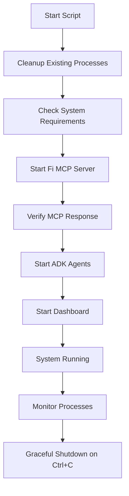

# 🚀 System Startup Guide

## Overview
Complete automation script for starting your Enhanced Financial Multi-Agent System. This script manages all components: Fi MCP Server, ADK Agents, and Dashboard with intelligent process management.

## 📋 What the Script Does

### 🧹 **Automatic Cleanup**
- Kills any existing Fi MCP server processes
- Terminates running Streamlit dashboards  
- Cleans up ADK agent processes
- Clears port conflicts (8080, 8501)

### 🚀 **System Startup**
1. **Fi MCP Server** - Starts the Go-based financial data server
2. **ADK Multi-Agent System** - Launches all 5 AI agents
3. **Dashboard** - Starts the Streamlit web interface

### 👁️ **Process Management**
- Monitors all processes
- Graceful shutdown with Ctrl+C
- Automatic cleanup on exit

## 🎯 Usage Options

### **Quick Start (Recommended)**
```bash
# Simple one-command startup
./start.sh
```

### **Python Direct**
```bash
# Direct Python execution
python start_system.py
```

### **Advanced Options**
```bash
# Start with enhanced dashboard
python start_system.py --dashboard enhanced

# Enable process monitoring
python start_system.py --monitor

# Enhanced dashboard with monitoring
python start_system.py --dashboard enhanced --monitor

# Cleanup only (kill existing processes)
python start_system.py --cleanup-only
```

### **Shell Wrapper Options**
```bash
# All Python options work with shell wrapper
./start.sh --dashboard enhanced
./start.sh --monitor
./start.sh --cleanup-only
```

## 📊 System Components Started

| Component | Port | Description | Status Check |
|-----------|------|-------------|--------------|
| **Fi MCP Server** | 8080 | Financial data server | HTTP endpoint |
| **ADK Agents** | - | Multi-agent AI system | Process monitoring |
| **Dashboard** | 8501 | Web interface | HTTP endpoint |

## ✅ System Requirements Check

The script automatically verifies:
- ✅ **Go Installation** - Required for Fi MCP server
- ✅ **Python Environment** - Virtual environment check
- ✅ **Port Availability** - Clears conflicts automatically
- ✅ **Directory Structure** - Validates project layout

## 🔄 Process Flow



## 🎛️ Configuration

### **Default Ports**
- Fi MCP Server: `8080`
- Dashboard: `8501`

### **Environment Variables**
- `FI_MCP_PORT=8080` - Automatically set
- `PYTHONPATH` - Automatically configured

### **Virtual Environment**
- Automatically activated if `venv/` exists
- Required dependencies loaded

## 📝 Startup Sequence Logs

```
[2024-01-26 14:30:00] INFO: 🚀 Starting Enhanced Financial Multi-Agent System
[2024-01-26 14:30:00] INFO: 🧹 Cleaning up existing processes...
[2024-01-26 14:30:02] INFO: ✅ Cleanup completed
[2024-01-26 14:30:02] INFO: ✅ Go found: go version go1.21.0 darwin/arm64
[2024-01-26 14:30:02] INFO: 🚀 Starting Fi MCP Server...
[2024-01-26 14:30:05] INFO: ✅ Fi MCP Server started on port 8080
[2024-01-26 14:30:05] INFO: ✅ Fi MCP Server responding at http://localhost:8080/
[2024-01-26 14:30:05] INFO: 🤖 Starting ADK Multi-Agent System...
[2024-01-26 14:30:08] INFO: ✅ ADK Multi-Agent System started successfully
[2024-01-26 14:30:08] INFO: 📊 Starting Original Dashboard...
[2024-01-26 14:30:15] INFO: ✅ Original Dashboard started on http://localhost:8501
[2024-01-26 14:30:15] INFO: 🎉 System started successfully!
[2024-01-26 14:30:15] INFO: 📊 Dashboard: http://localhost:8501
[2024-01-26 14:30:15] INFO: 🔌 Fi MCP Server: http://localhost:8080
[2024-01-26 14:30:15] INFO: 🤖 ADK Agents: Running
```

## 🛠 Troubleshooting

### **Common Issues**

#### **Go Not Found**
```bash
# Install Go (macOS)
brew install go

# Install Go (Linux)
sudo apt install golang-go
```

#### **Port Already in Use**
```bash
# Cleanup existing processes
python start_system.py --cleanup-only
```

#### **Virtual Environment Issues**
```bash
# Recreate virtual environment
rm -rf venv
python -m venv venv
source venv/bin/activate
pip install -r requirements.txt
```

#### **Permission Denied**
```bash
# Make scripts executable
chmod +x start_system.py start.sh
```

### **Manual Component Startup**

If you need to start components individually:

```bash
# Fi MCP Server only
cd fi-mcp-server
FI_MCP_PORT=8080 go run main.go

# ADK Agents only  
python main_adk.py

# Dashboard only
streamlit run dashboard/app.py --server.port=8501
```

## 🔧 Advanced Features

### **Process Monitoring**
```bash
# Enable monitoring (checks every 30 seconds)
python start_system.py --monitor
```

### **Custom Dashboard**
```bash
# Start with enhanced dashboard
python start_system.py --dashboard enhanced
```

### **Background Execution**
```bash
# Run in background (use with caution)
nohup python start_system.py > system.log 2>&1 &
```

## 🛑 Stopping the System

### **Graceful Shutdown**
- Press `Ctrl+C` in the terminal
- All processes will be stopped cleanly
- Ports will be freed automatically

### **Force Cleanup**
```bash
# If processes don't stop gracefully
python start_system.py --cleanup-only
```

## 🎯 Success Indicators

### **System Fully Running When You See:**
- ✅ All 3 components started successfully
- 📊 Dashboard accessible at http://localhost:8501
- 🔌 Fi MCP Server responding on port 8080
- 🤖 ADK Agents processing in background

### **Access Your System:**
1. **Dashboard**: http://localhost:8501
2. **Fi MCP Server**: http://localhost:8080  
3. **Interactive AI**: Use the AI chat in the dashboard

## 🚀 Quick Commands Summary

```bash
# Start everything (recommended)
./start.sh

# Start with enhanced dashboard
./start.sh --dashboard enhanced

# Start with monitoring
./start.sh --monitor

# Cleanup existing processes
./start.sh --cleanup-only

# Get help
python start_system.py --help
```

Your Enhanced Financial Multi-Agent System is now ready to run with a single command! 🎉 